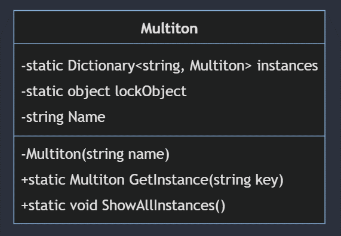
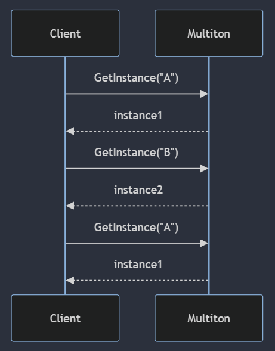
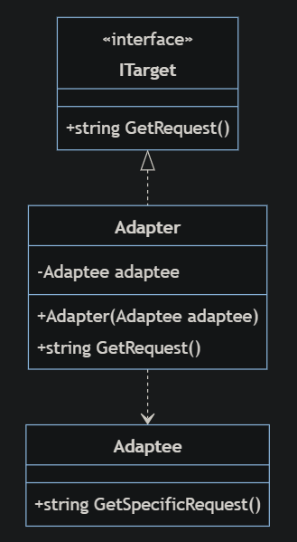
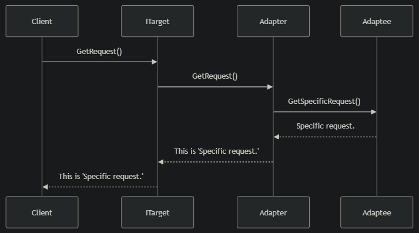
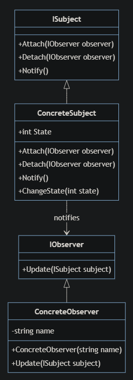
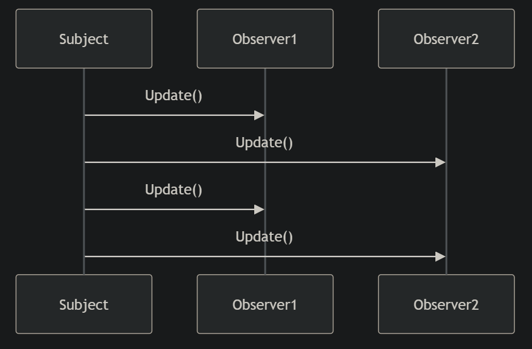
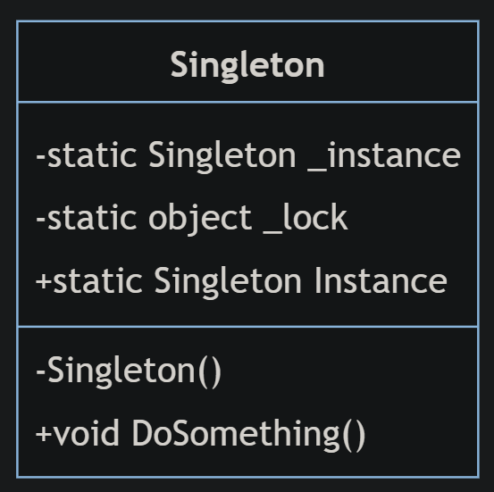
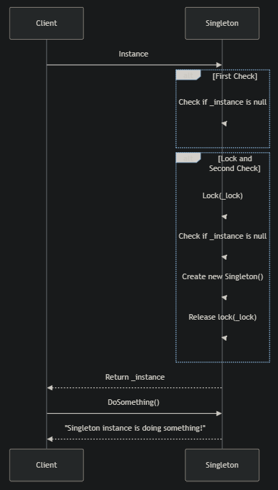

## Моделі

### Multiton
Мультитон – це шаблон проєктування, який дозволяє створювати лише один екземпляр об’єкта, але розширює його можливістю впорядковувати декілька екземплярів у вигляді іменованих пар ім'я-значення. \
Замість того, щоб забезпечувати наявність лише одного об'єкта в програмі, мультитон гарантує існування лише одного входження з відповідним ключем.   

### Adapter or Wrapper
Адаптер — це структурний патерн, який дозволяє подружити несумісні об’єкти. \
Адаптер виступає прошарком між двома об’єктами, перетворюючи виклики одного у виклики, що зрозумілі іншому. \
Патерн можна часто зустріти в C#-коді, особливо там, де потрібна конвертація різних типів даних або спільна робота класів з різними інтерфейсами. 

### Observer
Спостерігач — це поведінковий патерн, який дозволяє об’єктам повідомляти інші об’єкти про зміни свого стану. \
При цьому спостерігачі можуть вільно підписуватися і відписуватись від цих повідомлень. \
Спостерігач часто зустрічається в коді C#, особливо там, де до відносин між компонентами застосовується модель подій. Спостерігач дозволяє окремим компонентам реагувати на події, які відбуваються в інших компонентах.

### Double checked locking
Подвійне замикання - це шаблон проектування програмного забезпечення, який використовується для зменшення накладних витрат на придбання замка шляхом тестування критерію замикання («підказка щодо замка») перед придбанням замка. Блокування відбувається лише в тому випадку, якщо перевірка критерію блокування вказує на те, що потрібне блокування. \
Патерн зазвичай використовується для зменшення накладних витрат на блокування при реалізації "лінивої ініціалізації" в багатопотоковому середовищі, особливо як частина патерну Singleton. Лінива ініціалізація дозволяє уникнути ініціалізації значення до першого звернення.
 

